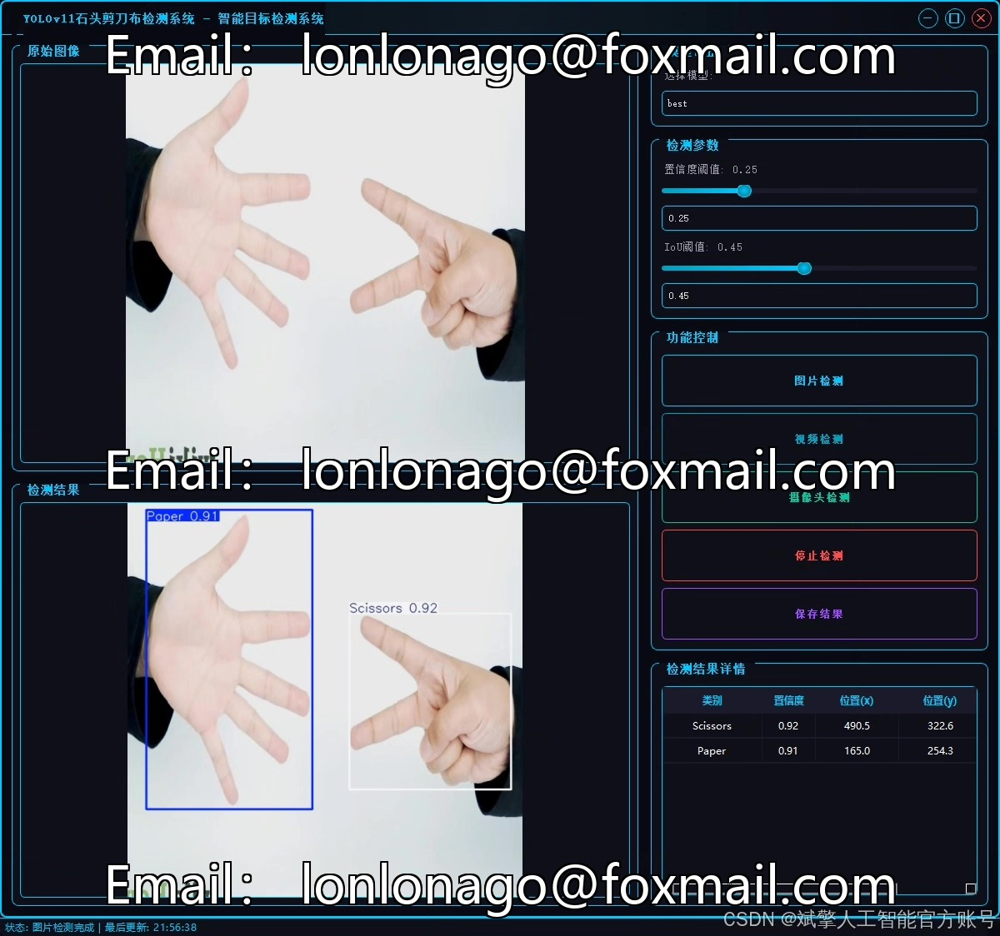
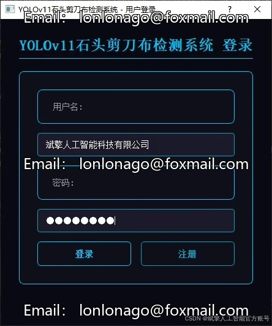
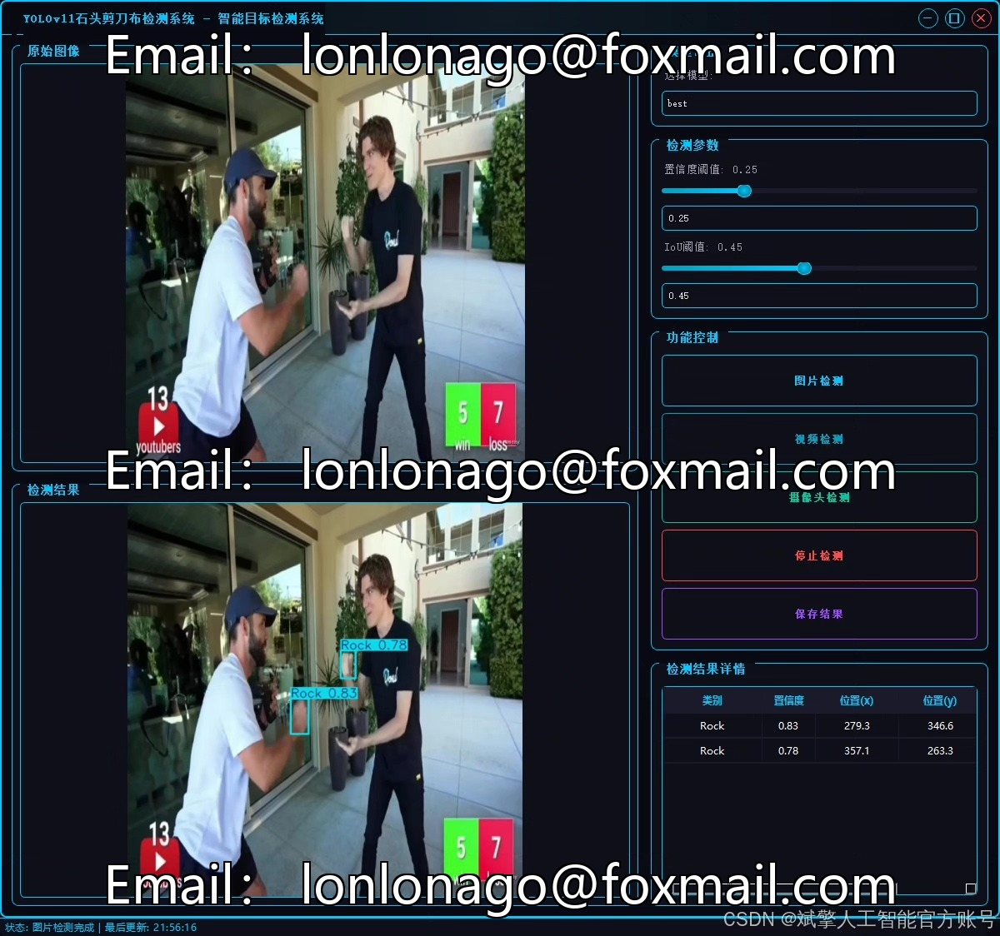
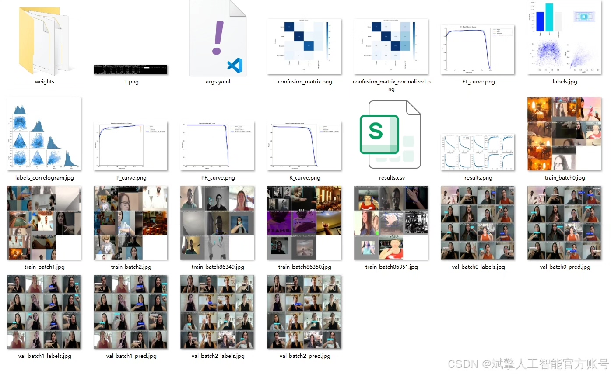
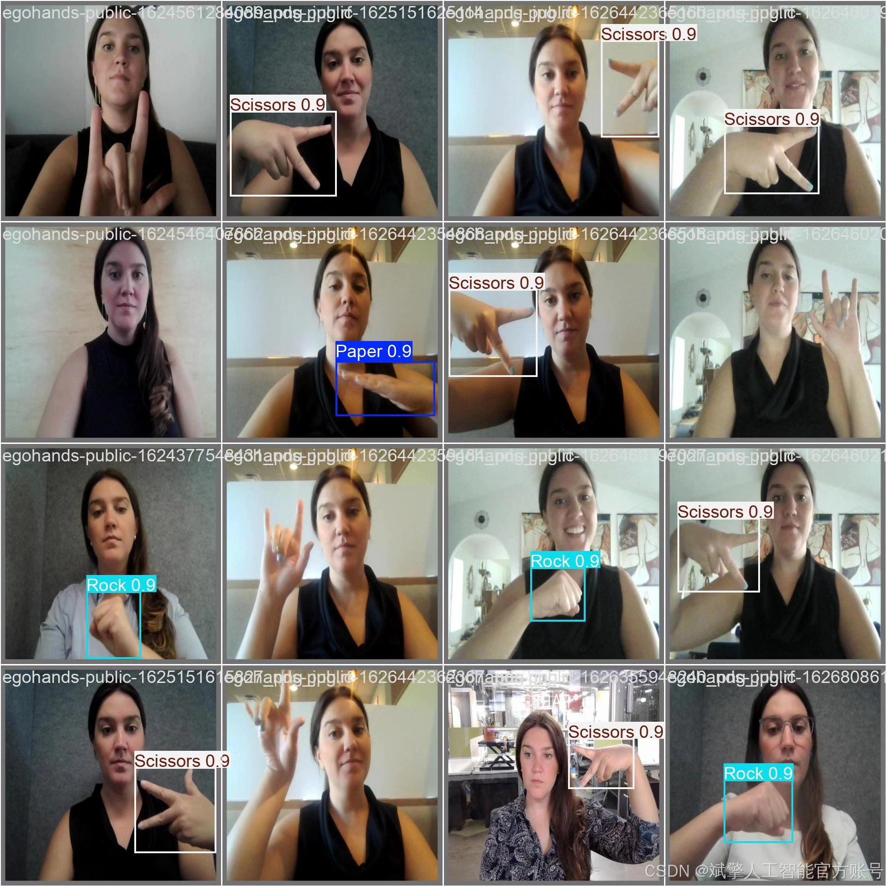
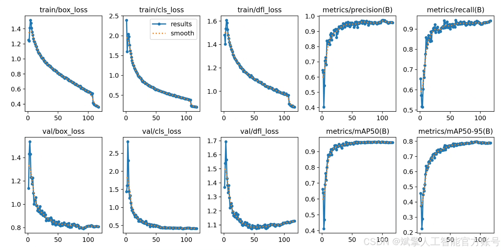
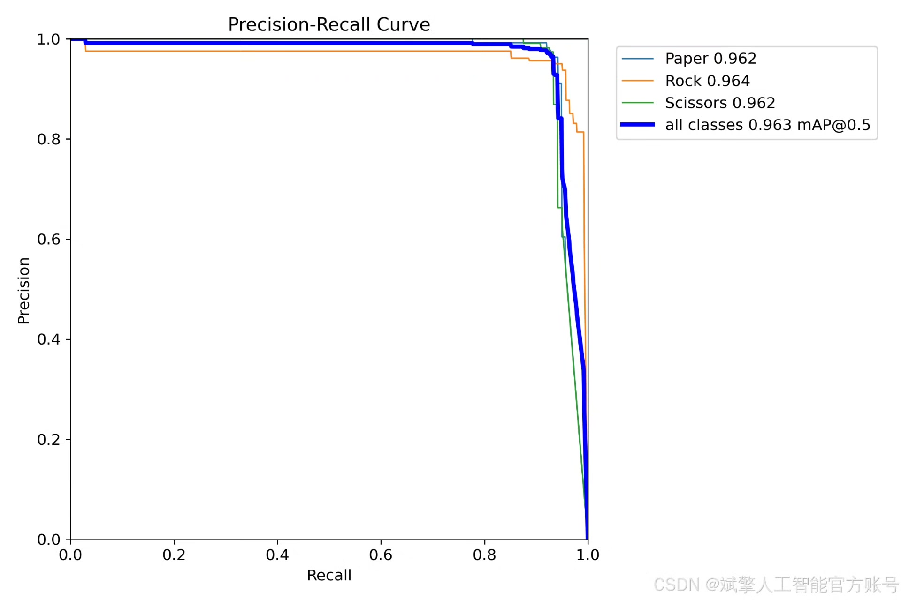

# YOLOv11 Scissors Rock Paper Detection System

## Body

YOLOv11 Swordfight Recognition System Based on Deep Learning YOLOv11: A Swordfight Gesture Recognition System (YOLOv11+YOLO dataset + UI interface + login and registration interface + Python project source code + model)

This paper proposes a stone-paper-scissors gesture recognition system based on the deep learning target detection model YOLOv11, capable of real-time detection and classification of user gestures (stone, scissors, and paper). The system utilizes the YOLOv11 model, combined with a high-quality custom YOLO dataset (containing 6,455 training images, 576 validation images, and 304 test images), to achieve high-precision detection performance. Additionally, the system is equipped with a user-friendly UI interface that supports login and registration functions. Experimental results show that the system performs excellently on the test set, meeting the requirements for real-time gesture recognition and providing a feasible solution for game interaction and intelligent control fields.

Dataset:
nc: 3
names: ['Paper', 'Rock', 'Scissors'],
dataset quantity: 6,455 training images, 576 validation images, and 304 test images.

✅ User login and registration: Supports password detection and security verification.
✅ Three detection modes: Based on the YOLOv11 model, supporting image, video, and real-time camera detection, accurately recognizing targets.
✅ Dual-screen comparison: Displaying the original image and detection result in the same screen.
✅ Data visualization: Real-time table displaying the category, confidence, and coordinates of detected targets.
✅ Intelligent parameter adjustment: Offering a confidence slide bar, dynamically optimizing detection accuracy to meet different scene needs.
✅ Sci-fi style interactive interface: Dark theme paired with dynamic light effects, reducing visual fatigue and enhancing operational experience.

## Images

## Payment

Here is a pay link on Stripe ( https://buy.stripe.com/3cs8yP7sY87d0vu9AB ). Please contact me lonlonago@foxmail.com after funding $89, and I will send you a complete data files , thank you!

